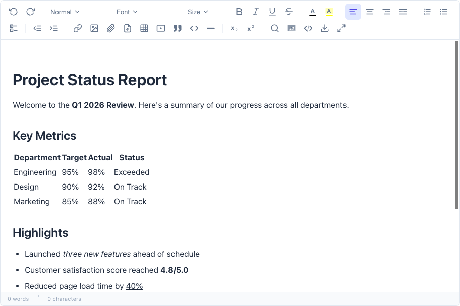
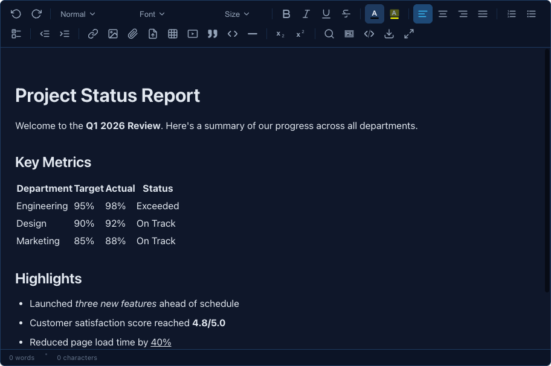

# Remyx Editor

A feature-rich WYSIWYG editor for React with a configurable toolbar, markdown support, theming, and a plugin system.

## Screenshots

### Light Theme

Rich text editing with headings, tables, lists, blockquotes, and a full-featured toolbar:



### Dark Theme (Ocean)

Built-in dark mode with multiple theme presets (Ocean, Forest, Sunset, Rose):



## Installation

```bash
npm install remyx-editor
```

Import the stylesheet in your app entry point:

```js
import 'remyx-editor/style.css';
```

## Quick Start

```jsx
import { RemyxEditor } from 'remyx-editor';
import 'remyx-editor/style.css';

function App() {
  const [content, setContent] = useState('');

  return (
    <RemyxEditor
      value={content}
      onChange={setContent}
      placeholder="Start typing..."
      height={400}
    />
  );
}
```

## Props

| Prop               | Type                                    | Default       | Description                                                       |
| ------------------ | --------------------------------------- | ------------- | ----------------------------------------------------------------- |
| `config`           | `string`                                | —             | Named editor config from `defineConfig()` (see Config File)       |
| `value`            | `string`                                | —             | Controlled content (HTML or Markdown)                             |
| `defaultValue`     | `string`                                | —             | Initial content for uncontrolled mode                             |
| `onChange`         | `(content: string) => void`             | —             | Called when content changes                                       |
| `outputFormat`     | `'html' \| 'markdown'`                  | `'html'`      | Output format for `onChange`                                      |
| `toolbar`          | `string[][]`                            | Full toolbar  | Custom toolbar configuration (see below)                          |
| `menuBar`          | `boolean \| MenuBarConfig[]`            | —             | Enable application-style menu bar (see Menu Bar)                  |
| `theme`            | `'light' \| 'dark'`                     | `'light'`     | Editor theme                                                      |
| `placeholder`      | `string`                                | `''`          | Placeholder text                                                  |
| `height`           | `number`                                | `300`         | Editor height in px                                               |
| `minHeight`        | `number`                                | —             | Minimum height override                                           |
| `maxHeight`        | `number`                                | —             | Maximum height (enables scrolling)                                |
| `readOnly`         | `boolean`                               | `false`       | Disable editing                                                   |
| `fonts`            | `string[]`                              | Built-in list | Custom font family options (replaces defaults)                    |
| `googleFonts`      | `string[]`                              | —             | Google Font families to auto-load and add to the font dropdown    |
| `statusBar`        | `'bottom' \| 'top' \| 'popup' \| false` | `'bottom'`    | Word/character count display position                             |
| `customTheme`      | `object`                                | —             | CSS variable overrides for custom theming (see Custom Themes)     |
| `toolbarItemTheme` | `object`                                | —             | Per-item toolbar styling overrides (see Per-Item Toolbar Theming) |
| `floatingToolbar`  | `boolean`                               | `true`        | Show floating toolbar on text selection                           |
| `contextMenu`      | `boolean`                               | `true`        | Show right-click context menu                                     |
| `plugins`          | `Plugin[]`                              | —             | Custom plugins                                                    |
| `uploadHandler`    | `(file: File) => Promise<string>`       | —             | Upload handler for images and file attachments (see File Uploads) |
| `shortcuts`        | `object`                                | —             | Custom keyboard shortcut overrides                                |
| `sanitize`         | `object`                                | —             | HTML sanitization options                                         |
| `attachTo`         | `React.RefObject`                       | —             | Attach editor to an existing element                              |
| `onReady`          | `(engine) => void`                      | —             | Called when the editor is initialized                             |
| `onFocus`          | `() => void`                            | —             | Called on editor focus                                            |
| `onBlur`           | `() => void`                            | —             | Called on editor blur                                             |
| `className`        | `string`                                | `''`          | CSS class for the editor wrapper                                  |
| `style`            | `object`                                | —             | Inline styles for the editor wrapper                              |

## Config File

For projects with multiple editors or shared defaults, you can define a centralized configuration file instead of repeating props on every `<RemyxEditor />` instance.

### Setup

Create a config file (e.g. `remyx.config.js`) at your project root:

```js
import { defineConfig } from 'remyx-editor';

export default defineConfig({
  // Default config applied to all editors
  theme: 'dark',
  placeholder: 'Start writing...',
  height: 400,

  // Named editor configurations
  editors: {
    minimal: {
      toolbar: [['bold', 'italic', 'underline'], ['link']],
      floatingToolbar: false,
      height: 200,
    },
    comments: {
      toolbar: [
        ['bold', 'italic', 'strikethrough'],
        ['orderedList', 'unorderedList'],
        ['link'],
      ],
      statusBar: false,
      height: 150,
      placeholder: 'Write a comment...',
    },
  },
});
```

### Usage

Wrap your app (or a section of it) with `RemyxConfigProvider` and pass the imported config:

```jsx
import { RemyxEditor, RemyxConfigProvider } from 'remyx-editor';
import config from './remyx.config.js';

function App() {
  return (
    <RemyxConfigProvider config={config}>
      {/* Uses default config */}
      <RemyxEditor />

      {/* Uses the "minimal" named config */}
      <RemyxEditor config="minimal" />

      {/* Uses the "comments" named config */}
      <RemyxEditor config="comments" />

      {/* Named config + prop override (prop wins) */}
      <RemyxEditor config="minimal" theme="light" />
    </RemyxConfigProvider>
  );
}
```

### Config Resolution Priority

When both a config file and component props are present, values are merged with this priority (highest wins):

1. **Component props** — explicitly passed props always take precedence
2. **Named editor config** — values from `editors.minimal`, `editors.comments`, etc.
3. **Default config** — top-level keys in the config file
4. **Built-in defaults** — the component's own defaults (e.g. `theme: 'light'`, `height: 300`)

### Without a Provider

Editors work exactly the same without a `RemyxConfigProvider` — all props behave as before. The provider is optional and additive.

## Toolbar Configuration

### Default Toolbar

The default toolbar includes all available items grouped by function:

```js
[
  ['undo', 'redo'],
  ['headings', 'fontFamily', 'fontSize'],
  ['bold', 'italic', 'underline', 'strikethrough'],
  ['foreColor', 'backColor'],
  ['alignLeft', 'alignCenter', 'alignRight', 'alignJustify'],
  ['orderedList', 'unorderedList', 'taskList'],
  ['outdent', 'indent'],
  [
    'link',
    'image',
    'table',
    'embedMedia',
    'blockquote',
    'codeBlock',
    'horizontalRule',
  ],
  ['subscript', 'superscript'],
  [
    'findReplace',
    'toggleMarkdown',
    'sourceMode',
    'export',
    'fullscreen',
  ],
];
```

Each inner array is a group separated visually by a divider in the toolbar.

### Custom Toolbar via Props

Pass a `toolbar` prop with your own configuration:

```jsx
<RemyxEditor
  toolbar={[
    ['bold', 'italic', 'underline'],
    ['orderedList', 'unorderedList'],
    ['link', 'image'],
  ]}
/>
```

### Toolbar Presets

Use built-in presets for common configurations:

```jsx
import { RemyxEditor, TOOLBAR_PRESETS } from 'remyx-editor'

// Full toolbar (default)
<RemyxEditor toolbar={TOOLBAR_PRESETS.full} />

// Standard — no source mode, markdown toggle, or embed
<RemyxEditor toolbar={TOOLBAR_PRESETS.standard} />

// Minimal — headings, basic formatting, lists, links, images
<RemyxEditor toolbar={TOOLBAR_PRESETS.minimal} />

// Bare — bold, italic, underline only
<RemyxEditor toolbar={TOOLBAR_PRESETS.bare} />
```

### Toolbar Helper Functions

Modify toolbar configs without rebuilding from scratch:

#### `removeToolbarItems(config, itemsToRemove)`

Remove specific items from a toolbar config:

```jsx
import { RemyxEditor, DEFAULT_TOOLBAR, removeToolbarItems } from 'remyx-editor'

const toolbar = removeToolbarItems(DEFAULT_TOOLBAR, ['image', 'table', 'embedMedia', 'export'])

<RemyxEditor toolbar={toolbar} />
```

#### `addToolbarItems(config, items, options?)`

Add items to a toolbar config:

```jsx
import {
  RemyxEditor,
  TOOLBAR_PRESETS,
  addToolbarItems,
} from 'remyx-editor';

// Append as a new group
const toolbar = addToolbarItems(TOOLBAR_PRESETS.minimal, [
  'fullscreen',
]);

// Add to an existing group (by index, -1 = last)
const toolbar = addToolbarItems(
  TOOLBAR_PRESETS.minimal,
  'fullscreen',
  { group: -1 },
);

// Insert after a specific item
const toolbar = addToolbarItems(TOOLBAR_PRESETS.minimal, 'taskList', {
  after: 'unorderedList',
});

// Insert before a specific item
const toolbar = addToolbarItems(
  TOOLBAR_PRESETS.minimal,
  'strikethrough',
  { before: 'underline' },
);
```

#### `createToolbar(items)`

Build a toolbar from a flat list of command names. Items are automatically grouped by category:

```jsx
import { RemyxEditor, createToolbar } from 'remyx-editor'

const toolbar = createToolbar([
  'bold', 'italic', 'underline',
  'headings',
  'link', 'image',
  'orderedList', 'unorderedList',
  'fullscreen',
])
// Result:
// [
//   ['headings'],
//   ['bold', 'italic', 'underline'],
//   ['orderedList', 'unorderedList'],
//   ['link', 'image'],
//   ['fullscreen'],
// ]

<RemyxEditor toolbar={toolbar} />
```

### Available Toolbar Items

| Item             | Type         | Description                                              |
| ---------------- | ------------ | -------------------------------------------------------- |
| `undo`           | Button       | Undo last action                                         |
| `redo`           | Button       | Redo last action                                         |
| `headings`       | Dropdown     | Block type selector (Normal, H1–H6)                      |
| `fontFamily`     | Dropdown     | Font family selector                                     |
| `fontSize`       | Dropdown     | Font size selector                                       |
| `bold`           | Button       | Bold text                                                |
| `italic`         | Button       | Italic text                                              |
| `underline`      | Button       | Underline text                                           |
| `strikethrough`  | Button       | Strikethrough text                                       |
| `subscript`      | Button       | Subscript text                                           |
| `superscript`    | Button       | Superscript text                                         |
| `foreColor`      | Color Picker | Text color                                               |
| `backColor`      | Color Picker | Background/highlight color                               |
| `alignLeft`      | Button       | Align left                                               |
| `alignCenter`    | Button       | Align center                                             |
| `alignRight`     | Button       | Align right                                              |
| `alignJustify`   | Button       | Justify text                                             |
| `orderedList`    | Button       | Numbered list                                            |
| `unorderedList`  | Button       | Bulleted list                                            |
| `taskList`       | Button       | Task/checkbox list                                       |
| `indent`         | Button       | Increase indent                                          |
| `outdent`        | Button       | Decrease indent                                          |
| `link`           | Button       | Insert/edit link (opens modal)                           |
| `image`          | Button       | Insert image (opens modal)                               |
| `attachment`     | Button       | Attach file (opens modal)                                |
| `importDocument` | Button       | Import document — PDF, DOCX, MD, CSV, etc. (opens modal) |
| `table`          | Button       | Insert table (opens picker)                              |
| `embedMedia`     | Button       | Embed video/media (opens modal)                          |
| `blockquote`     | Button       | Block quote                                              |
| `codeBlock`      | Button       | Code block                                               |
| `horizontalRule` | Button       | Horizontal divider                                       |
| `findReplace`    | Button       | Find and replace (opens panel)                           |
| `toggleMarkdown` | Button       | Toggle markdown editing mode                             |
| `sourceMode`     | Button       | View/edit HTML source                                    |
| `export`         | Button       | Export document (PDF, Markdown, DOCX)                    |
| `fullscreen`     | Button       | Toggle fullscreen mode                                   |

## Menu Bar

Add an application-style menu bar (File, Edit, View, Insert, Format) above the toolbar. When enabled, items that appear in the menu bar are automatically removed from the toolbar to avoid duplication. Each menu item displays its icon, label, and keyboard shortcut (if available), and toggle-style commands (bold, italic, fullscreen, etc.) show their active state with a visual indicator.

### Enable with Defaults

Pass `menuBar={true}` to use the built-in default menu bar:

```jsx
<RemyxEditor menuBar={true} />
```

The default menu bar includes:

| Menu       | Items                                                                                      |
| ---------- | ------------------------------------------------------------------------------------------ |
| **File**   | Import Document, Export Document                                                           |
| **Edit**   | Undo, Redo, Find & Replace                                                                |
| **View**   | Fullscreen, Toggle Markdown, Source Mode                                                   |
| **Insert** | Link, Image, Table, Attachment, Embed Media, Blockquote, Code Block, Horizontal Rule       |
| **Format** | Bold, Italic, Underline, Strikethrough, Subscript, Superscript, Alignment ▸, Lists, Colors |

### Default Menu Bar Structure

The full `DEFAULT_MENU_BAR` config is exported so you can use it as a starting point for customization:

```js
import { DEFAULT_MENU_BAR } from 'remyx-editor';

// DEFAULT_MENU_BAR is:
[
  { label: 'File', items: ['importDocument', 'export'] },
  { label: 'Edit', items: ['undo', 'redo', '---', 'findReplace'] },
  { label: 'View', items: ['fullscreen', 'toggleMarkdown', 'sourceMode'] },
  { label: 'Insert', items: [
    'link', 'image', 'table', 'attachment', 'embedMedia',
    '---', 'blockquote', 'codeBlock', 'horizontalRule',
  ]},
  { label: 'Format', items: [
    'bold', 'italic', 'underline', 'strikethrough',
    '---', 'subscript', 'superscript',
    '---',
    { label: 'Alignment', items: ['alignLeft', 'alignCenter', 'alignRight', 'alignJustify'] },
    '---', 'orderedList', 'unorderedList', 'taskList',
    '---', 'foreColor', 'backColor',
  ]},
]
```

### Custom Menu Bar

Pass an array of menu objects to fully customize which menus and items appear:

```jsx
<RemyxEditor
  menuBar={[
    { label: 'File', items: ['importDocument', 'export'] },
    { label: 'Edit', items: ['undo', 'redo', '---', 'findReplace'] },
    { label: 'Format', items: [
      'bold', 'italic', 'underline',
      '---',
      { label: 'Alignment', items: ['alignLeft', 'alignCenter', 'alignRight', 'alignJustify'] },
    ]},
  ]}
/>
```

#### Menu Configuration Schema

Each menu object has:

| Property | Type                              | Description                                                     |
| -------- | --------------------------------- | --------------------------------------------------------------- |
| `label`  | `string`                          | Menu trigger label displayed in the menu bar (e.g. "File")      |
| `items`  | `(string \| SubMenu \| '---')[]` | Array of command names, `'---'` separators, or submenu objects   |

Submenu objects follow the same `{ label, items }` shape for nested menus. Any command from the [Available Toolbar Items](#available-toolbar-items) table can be used as a menu item.

#### Separators

Use the `'---'` string to add visual separators between groups of related items:

```js
{ label: 'Edit', items: ['undo', 'redo', '---', 'findReplace'] }
//                                         ^^^
//                         separator between redo and find/replace
```

#### Submenus

Nest menus by using an object with `label` and `items` instead of a command string:

```js
{ label: 'Format', items: [
  'bold', 'italic',
  '---',
  { label: 'Alignment', items: ['alignLeft', 'alignCenter', 'alignRight', 'alignJustify'] },
  { label: 'Lists', items: ['orderedList', 'unorderedList', 'taskList'] },
]}
```

Submenus open on hover and display a chevron (▸) indicator.

### Menu Bar with Config File

The `menuBar` prop can also be set via the config file system:

```js
import { defineConfig } from 'remyx-editor';

export default defineConfig({
  theme: 'dark',
  menuBar: true, // enable default menu bar for all editors

  editors: {
    full: {
      menuBar: true, // default menu bar for this editor
    },
    minimal: {
      menuBar: [
        { label: 'Edit', items: ['undo', 'redo'] },
        { label: 'Format', items: ['bold', 'italic', 'underline'] },
      ],
      toolbar: [['headings', 'fontFamily', 'fontSize']],
    },
    simple: {
      // no menuBar — toolbar only
      toolbar: [['bold', 'italic'], ['link']],
    },
  },
});
```

### Toolbar Auto-Deduplication

When a menu bar is active and no explicit `toolbar` prop is passed, toolbar items that also appear in the menu bar are automatically removed from the toolbar. This keeps the UI clean — commands are accessible from the menu bar while the toolbar retains only items not covered by the menus (e.g. dropdowns like Headings, Font, and Size).

To keep the full toolbar alongside a menu bar, pass an explicit `toolbar` prop:

```jsx
import { DEFAULT_TOOLBAR } from 'remyx-editor';

<RemyxEditor menuBar={true} toolbar={DEFAULT_TOOLBAR} />
```

### Menu Bar Behavior

- **Click** a menu trigger to open its dropdown
- **Hover** over other triggers while a menu is open to switch menus instantly
- **Click** a menu item to execute the command and close the menu
- **Escape** or click outside to close an open menu
- Submenus open on hover with a chevron (▸) indicator
- Toggle commands (bold, italic, fullscreen, etc.) display active state highlighting
- Modal commands (link, image, table, etc.) open their respective dialogs
- Menu bar automatically inherits the editor's theme (light/dark) and custom theme variables

## Multiple Editors

Multiple `<RemyxEditor />` instances can be rendered on the same page without any additional configuration. Each editor is fully isolated — no shared state, no event conflicts, and no DOM collisions.

### Basic Usage

```jsx
function App() {
  return (
    <>
      <RemyxEditor placeholder="Editor 1..." height={300} />
      <RemyxEditor placeholder="Editor 2..." height={300} />
      <RemyxEditor placeholder="Editor 3..." height={200} />
    </>
  );
}
```

### What's Isolated Per Instance

Each editor maintains its own:

| Feature              | Isolation                                                              |
| -------------------- | ---------------------------------------------------------------------- |
| **Content & state**  | Separate undo/redo history, content, and selection tracking            |
| **Toolbar**          | Independent toolbar state — dropdowns, color pickers, active states    |
| **Menu bar**         | Menus open/close independently; hover-switching is scoped per editor   |
| **Modals**           | Each editor opens its own modals (link, image, table, find/replace)    |
| **Floating toolbar** | Appears only for the editor with an active text selection              |
| **Context menu**     | Right-click menus are scoped to the editor that was clicked            |
| **Fullscreen**       | Each editor can enter/exit fullscreen independently                    |
| **Plugins**          | Plugin instances are created per editor with separate state            |
| **Events**           | Each editor has its own `EventBus` — listeners don't cross boundaries  |
| **Keyboard shortcuts** | Shortcuts only fire for the focused editor                          |

### Mixed Configurations

Combine different toolbars, themes, menu bars, and config files on a single page:

```jsx
import { RemyxEditor, RemyxConfigProvider, defineConfig } from 'remyx-editor';

const config = defineConfig({
  theme: 'dark',
  editors: {
    minimal: {
      toolbar: [['bold', 'italic', 'underline'], ['link']],
      height: 150,
    },
    comments: {
      toolbar: [['bold', 'italic'], ['orderedList', 'unorderedList']],
      statusBar: false,
      height: 120,
    },
  },
});

function App() {
  return (
    <RemyxConfigProvider config={config}>
      {/* Full editor with menu bar */}
      <RemyxEditor menuBar={true} height={400} />

      {/* Side-by-side editors */}
      <div style={{ display: 'grid', gridTemplateColumns: '1fr 1fr', gap: 16 }}>
        <RemyxEditor config="minimal" />
        <RemyxEditor config="comments" />
      </div>

      {/* Standalone with different theme */}
      <RemyxEditor theme="light" placeholder="Standalone editor" />
    </RemyxConfigProvider>
  );
}
```

### Notes

- There is no hard limit on the number of editors per page. Performance scales linearly with each instance.
- Editors inside a `RemyxConfigProvider` share the config object (read-only), but all runtime state is per-instance.
- The `attachTo` prop also works with multiple editors — each can attach to its own `<textarea>` or `<div>`.

## Font Configuration

### Custom Font List

Replace the default font dropdown entirely with your own fonts:

```jsx
<RemyxEditor
  fonts={['Arial', 'Georgia', 'Courier New', 'My Custom Font']}
/>
```

### Google Fonts

Pass Google Font family names via the `googleFonts` prop. The editor automatically loads the fonts from Google Fonts and adds them to the dropdown:

```jsx
// Add Google Fonts alongside the defaults
<RemyxEditor googleFonts={['Roboto', 'Open Sans', 'Lato', 'Montserrat']} />

// Combine with a custom font list
<RemyxEditor
  fonts={['Arial', 'Georgia']}
  googleFonts={['Poppins', 'Inter', 'Playfair Display']}
/>

// Request specific weights
<RemyxEditor googleFonts={['Roboto:wght@400;700', 'Open Sans:ital,wght@0,400;1,400']} />
```

When `googleFonts` is provided, the fonts are automatically loaded via the Google Fonts CDN and appended to the font dropdown. If `fonts` is also set, Google Fonts are merged into that list. Otherwise they're merged into the default font list.

### Font Helper Functions

#### `removeFonts(fonts, fontsToRemove)`

Remove fonts from a font list:

```jsx
import { RemyxEditor, DEFAULT_FONTS, removeFonts } from 'remyx-editor'

const fonts = removeFonts(DEFAULT_FONTS, ['Comic Sans MS', 'Impact', 'Arial Black'])

<RemyxEditor fonts={fonts} />
```

#### `addFonts(fonts, fontsToAdd, options?)`

Add fonts to a font list:

```jsx
import { RemyxEditor, DEFAULT_FONTS, addFonts } from 'remyx-editor'

// Append fonts to the end
const fonts = addFonts(DEFAULT_FONTS, ['My Custom Font', 'Another Font'])

// Prepend fonts to the beginning
const fonts = addFonts(DEFAULT_FONTS, ['My Custom Font'], { position: 'start' })

<RemyxEditor fonts={fonts} />
```

#### `loadGoogleFonts(fontFamilies)`

Standalone utility to load Google Fonts. Useful outside the editor or when using `useRemyxEditor`:

```js
import { loadGoogleFonts } from 'remyx-editor';

// Load fonts programmatically
loadGoogleFonts(['Roboto', 'Lato', 'Montserrat']);

// With specific weights
loadGoogleFonts(['Roboto:wght@400;700']);
```

## Status Bar (Word & Character Count)

The status bar displays word and character counts. Use the `statusBar` prop to control its position or display mode.

### Bottom (default)

Displays below the editor content area:

```jsx
<RemyxEditor statusBar="bottom" />
```

### Top

Displays above the editor content area, between the toolbar and the editing surface:

```jsx
<RemyxEditor statusBar="top" />
```

### Popup

Adds a word count button to the toolbar. Click it to see counts in a popover:

```jsx
<RemyxEditor statusBar="popup" />
```

### Hidden

Disable the status bar entirely:

```jsx
<RemyxEditor statusBar={false} />
```

## Theming

```jsx
// Light theme (default)
<RemyxEditor theme="light" />

// Dark theme
<RemyxEditor theme="dark" />
```

### Custom Themes

Use the `customTheme` prop to override any CSS variable. Custom themes layer on top of the base `theme` (light or dark), so you only need to specify the variables you want to change.

#### Using `createTheme()`

The `createTheme` helper maps friendly camelCase keys to CSS variables:

```jsx
import { RemyxEditor, createTheme } from 'remyx-editor'

const brandTheme = createTheme({
  bg: '#1a1a2e',
  text: '#e0e0e0',
  primary: '#e94560',
  primaryHover: '#c81e45',
  primaryLight: 'rgba(233, 69, 96, 0.15)',
  toolbarBg: '#16213e',
  toolbarIcon: '#94a3b8',
  toolbarIconActive: '#e94560',
  radius: '12px',
  contentFontSize: '18px',
})

<RemyxEditor theme="dark" customTheme={brandTheme} />
```

#### Using raw CSS variables

You can also pass CSS variable names directly:

```jsx
<RemyxEditor
  customTheme={{
    '--rmx-primary': '#e94560',
    '--rmx-bg': '#1a1a2e',
    '--rmx-radius': '0px',
  }}
/>
```

#### Theme Presets

Built-in custom theme presets are available:

```jsx
import { RemyxEditor, THEME_PRESETS } from 'remyx-editor'

<RemyxEditor theme="dark" customTheme={THEME_PRESETS.ocean} />
<RemyxEditor theme="dark" customTheme={THEME_PRESETS.forest} />
<RemyxEditor theme="dark" customTheme={THEME_PRESETS.sunset} />
<RemyxEditor theme="dark" customTheme={THEME_PRESETS.rose} />
```

#### Available Theme Variables

| Key                   | CSS Variable                  | Description                 |
| --------------------- | ----------------------------- | --------------------------- |
| `bg`                  | `--rmx-bg`                    | Editor background           |
| `text`                | `--rmx-text`                  | Primary text color          |
| `textSecondary`       | `--rmx-text-secondary`        | Muted text color            |
| `border`              | `--rmx-border`                | Border color                |
| `borderSubtle`        | `--rmx-border-subtle`         | Subtle border color         |
| `toolbarBg`           | `--rmx-toolbar-bg`            | Toolbar background          |
| `toolbarBorder`       | `--rmx-toolbar-border`        | Toolbar border              |
| `toolbarButtonHover`  | `--rmx-toolbar-button-hover`  | Button hover background     |
| `toolbarButtonActive` | `--rmx-toolbar-button-active` | Button active background    |
| `toolbarIcon`         | `--rmx-toolbar-icon`          | Icon color                  |
| `toolbarIconActive`   | `--rmx-toolbar-icon-active`   | Active icon color           |
| `primary`             | `--rmx-primary`               | Primary accent color        |
| `primaryHover`        | `--rmx-primary-hover`         | Primary hover color         |
| `primaryLight`        | `--rmx-primary-light`         | Light primary (backgrounds) |
| `focusRing`           | `--rmx-focus-ring`            | Focus outline color         |
| `selection`           | `--rmx-selection`             | Text selection color        |
| `danger`              | `--rmx-danger`                | Error/danger color          |
| `dangerLight`         | `--rmx-danger-light`          | Light danger color          |
| `placeholder`         | `--rmx-placeholder`           | Placeholder text color      |
| `modalBg`             | `--rmx-modal-bg`              | Modal background            |
| `modalOverlay`        | `--rmx-modal-overlay`         | Modal overlay               |
| `statusbarBg`         | `--rmx-statusbar-bg`          | Status bar background       |
| `statusbarText`       | `--rmx-statusbar-text`        | Status bar text             |
| `fontFamily`          | `--rmx-font-family`           | UI font stack               |
| `fontSize`            | `--rmx-font-size`             | UI font size                |
| `contentFontSize`     | `--rmx-content-font-size`     | Content font size           |
| `contentLineHeight`   | `--rmx-content-line-height`   | Content line height         |
| `radius`              | `--rmx-radius`                | Border radius               |
| `radiusSm`            | `--rmx-radius-sm`             | Small border radius         |
| `spacingXs`           | `--rmx-spacing-xs`            | Extra small spacing         |
| `spacingSm`           | `--rmx-spacing-sm`            | Small spacing               |
| `spacingMd`           | `--rmx-spacing-md`            | Medium spacing              |

### Per-Item Toolbar Theming

While `customTheme` styles all toolbar buttons uniformly, the `toolbarItemTheme` prop lets you style **individual toolbar items** independently. This is useful for branding specific buttons, creating visual groupings, or building highly custom editor UIs.

#### Using `createToolbarItemTheme()`

The `createToolbarItemTheme` helper converts friendly camelCase overrides into the resolved format expected by the prop:

```jsx
import { RemyxEditor, createToolbarItemTheme } from 'remyx-editor'

const itemTheme = createToolbarItemTheme({
  bold:      { color: '#e11d48', activeColor: '#be123c', activeBackground: '#ffe4e6', borderRadius: '50%' },
  italic:    { color: '#7c3aed', activeColor: '#6d28d9', activeBackground: '#ede9fe' },
  underline: { color: '#0891b2', activeColor: '#0e7490', activeBackground: '#cffafe' },
  _separator: { color: '#c4b5fd', width: '2px' },
})

<RemyxEditor toolbarItemTheme={itemTheme} />
```

Keys are toolbar command names (e.g. `bold`, `italic`, `headings`, `fontFamily`). The special `_separator` key styles all group dividers. Items without an entry inherit from the global theme as usual.

#### Using raw CSS variables

You can also pass pre-resolved CSS variable objects directly:

```jsx
<RemyxEditor
  toolbarItemTheme={{
    bold: { '--rmx-tb-color': '#e11d48', '--rmx-tb-radius': '50%' },
    _separator: { '--rmx-tb-sep-color': '#c4b5fd' },
  }}
/>
```

#### Composing with `customTheme`

Both props can be used together. `customTheme` sets the global theme, and `toolbarItemTheme` overrides specific items on top of it:

```jsx
<RemyxEditor
  theme="dark"
  customTheme={THEME_PRESETS.ocean}
  toolbarItemTheme={createToolbarItemTheme({
    bold: { color: '#f97316', activeColor: '#ea580c' },
  })}
/>
```

#### Available Per-Item Style Properties

| Key                | CSS Variable            | Description                 |
| ------------------ | ----------------------- | --------------------------- |
| `color`            | `--rmx-tb-color`        | Icon / text color           |
| `background`       | `--rmx-tb-bg`           | Default background          |
| `hoverColor`       | `--rmx-tb-hover-color`  | Color on hover              |
| `hoverBackground`  | `--rmx-tb-hover-bg`     | Background on hover         |
| `activeColor`      | `--rmx-tb-active-color` | Color when active / pressed |
| `activeBackground` | `--rmx-tb-active-bg`    | Background when active      |
| `border`           | `--rmx-tb-border`       | Border shorthand            |
| `borderRadius`     | `--rmx-tb-radius`       | Border radius               |
| `size`             | `--rmx-tb-size`         | Button width & height       |
| `iconSize`         | `--rmx-tb-icon-size`    | Icon size inside button     |
| `padding`          | `--rmx-tb-padding`      | Button padding              |
| `opacity`          | `--rmx-tb-opacity`      | Button opacity              |

#### Separator Style Properties

When using the `_separator` key, the following properties are available:

| Key      | CSS Variable          | Description      |
| -------- | --------------------- | ---------------- |
| `color`  | `--rmx-tb-sep-color`  | Separator color  |
| `width`  | `--rmx-tb-sep-width`  | Separator width  |
| `height` | `--rmx-tb-sep-height` | Separator height |
| `margin` | `--rmx-tb-sep-margin` | Separator margin |

## Paste & Auto-Conversion

The editor automatically handles pasting from a wide range of sources. Rich text content is cleaned and normalized through a multi-stage pipeline, and plain text is analyzed for markdown patterns.

### Supported Sources

| Source                       | What Happens                                                                                                                                                                                 |
| ---------------------------- | -------------------------------------------------------------------------------------------------------------------------------------------------------------------------------------------- |
| **Microsoft Word**           | Strips Office XML, `mso-*` styles, `MsoNormal` classes, conditional comments, and `<o:p>` tags. Converts Word-style indented bullet/number paragraphs into proper `<ul>`/`<ol>` lists.       |
| **Google Docs**              | Removes `docs-internal-*` IDs, single-letter class names, `dir="ltr"` attributes. Converts `font-weight: 700` spans to `<strong>`, italic spans to `<em>`, and strikethrough spans to `<s>`. |
| **LibreOffice / OpenOffice** | Strips namespace tags (`text:`, `office:`, `draw:`, etc.) and auto-generated class names (`P1`, `T2`, `Table3`).                                                                             |
| **Apple Pages**              | Removes iWork-specific classes and `apple-content-edited` attributes.                                                                                                                        |
| **Markdown text**            | When pasting plain text that looks like markdown (headings, lists, bold, links, code fences, etc.), the editor auto-detects and converts it to rich HTML — even in HTML output mode.         |
| **Plain text**               | Wraps paragraphs in `<p>` tags and converts line breaks to `<br>`.                                                                                                                           |
| **Images**                   | Pasted or dropped images are inserted inline as base64 data URIs (or uploaded via `uploadHandler` if configured).                                                                            |

### How It Works

All paste input paths (keyboard paste, drag-and-drop, and context menu paste) share the same pipeline:

1. **Rich text (HTML)**: `cleanPastedHTML()` strips source-specific markup → `Sanitizer.sanitize()` applies tag/attribute allowlisting
2. **Plain text**: `looksLikeMarkdown()` checks for markdown patterns → converts via `markdownToHtml()` if detected, otherwise wraps in `<p>` tags

### Paste Utilities

The paste cleaning functions are also exported for standalone use:

```js
import { cleanPastedHTML, looksLikeMarkdown } from 'remyx-editor';

// Clean HTML from external sources
const clean = cleanPastedHTML(wordHtml);

// Check if text looks like markdown
if (looksLikeMarkdown(text)) {
  // convert it...
}
```

## File Uploads (Images & Attachments)

The `uploadHandler` prop controls where uploaded images and file attachments are stored. It receives a `File` object and must return a `Promise<string>` resolving to the URL where the file can be accessed.

When no `uploadHandler` is provided, images are inserted as inline base64 data URIs and the file attachment upload tab is disabled.

### Signature

```ts
uploadHandler: (file: File) => Promise<string>;
```

### Local / Custom Server Upload

Save files to your own server or a local path:

```jsx
<RemyxEditor
  uploadHandler={async (file) => {
    const formData = new FormData();
    formData.append('file', file);

    const res = await fetch('/api/upload', {
      method: 'POST',
      body: formData,
    });

    const { url } = await res.json();
    return url; // e.g. "/uploads/photo-abc123.jpg"
  }}
/>
```

### AWS S3 Upload

Upload directly to an S3 bucket using pre-signed URLs:

```jsx
<RemyxEditor
  uploadHandler={async (file) => {
    // 1. Get a pre-signed upload URL from your backend
    const res = await fetch('/api/s3-presign', {
      method: 'POST',
      headers: { 'Content-Type': 'application/json' },
      body: JSON.stringify({
        filename: file.name,
        contentType: file.type,
      }),
    });
    const { uploadUrl, publicUrl } = await res.json();

    // 2. Upload directly to S3
    await fetch(uploadUrl, {
      method: 'PUT',
      headers: { 'Content-Type': file.type },
      body: file,
    });

    // 3. Return the public URL for the editor to use
    return publicUrl; // e.g. "https://my-bucket.s3.amazonaws.com/uploads/photo-abc123.jpg"
  }}
/>
```

### Cloudflare R2 / Google Cloud Storage

The same pre-signed URL pattern works with any S3-compatible service:

```jsx
<RemyxEditor
  uploadHandler={async (file) => {
    const { uploadUrl, publicUrl } = await getPresignedUrl(file);
    await fetch(uploadUrl, { method: 'PUT', body: file });
    return publicUrl;
  }}
/>
```

### How It Works

The `uploadHandler` is used consistently across all upload paths in the editor:

| Path                                       | Behavior                                                                 |
| ------------------------------------------ | ------------------------------------------------------------------------ |
| **Image toolbar button** (Upload tab)      | File picker triggers `uploadHandler`, URL is inserted as ``         |
| **Attachment toolbar button** (Upload tab) | File picker triggers `uploadHandler`, URL is inserted as attachment chip |
| **Drag & drop image**                      | Dropped image files trigger `uploadHandler`                              |
| **Drag & drop file**                       | Non-image files trigger `uploadHandler`, inserted as attachment          |
| **Paste image**                            | Pasted images trigger `uploadHandler` (falls back to base64 if not set)  |
| **Paste file**                             | Non-image pasted files trigger `uploadHandler`, inserted as attachment   |

### Without `uploadHandler`

When no handler is provided:

- **Images**: Inserted as inline base64 data URIs (works but increases HTML size)
- **File attachments**: Upload tab shows "Upload requires an uploadHandler" message; URL tab still works for linking to externally hosted files

## Output Formats

```jsx
// HTML output (default)
<RemyxEditor outputFormat="html" onChange={(html) => console.log(html)} />

// Markdown output
<RemyxEditor outputFormat="markdown" onChange={(md) => console.log(md)} />
```

Conversion utilities are also available for standalone use:

```js
import { htmlToMarkdown, markdownToHtml } from 'remyx-editor';

const md = htmlToMarkdown('<h1>Hello</h1><p>World</p>');
const html = markdownToHtml('# Hello\n\nWorld');
```

## Attaching to Existing Elements

Enhance an existing `<textarea>` or `<div>` with a full WYSIWYG editor using the `attachTo` prop:

### Textarea

```jsx
import { useRef } from 'react';
import { RemyxEditor } from 'remyx-editor';

function App() {
  const textareaRef = useRef(null);

  return (
    <>
      <textarea ref={textareaRef} defaultValue="Initial content" />
      <RemyxEditor
        attachTo={textareaRef}
        outputFormat="markdown"
        height={400}
      />
    </>
  );
}
```

The textarea is hidden and replaced with the editor. Its value stays in sync and is submitted with any parent `<form>`.

### Div

```jsx
function App() {
  const divRef = useRef(null);

  return (
    <>
      <div ref={divRef}>
        <h2>Existing content</h2>
        <p>This will become editable.</p>
      </div>
      <RemyxEditor attachTo={divRef} theme="dark" height={400} />
    </>
  );
}
```

### `useRemyxEditor` Hook

For lower-level control, use the hook directly:

```jsx
import { useRef } from 'react';
import { useRemyxEditor } from 'remyx-editor';

function App() {
  const targetRef = useRef(null);
  const { engine, containerRef, editableRef, ready } = useRemyxEditor(
    targetRef,
    {
      onChange: (content) => console.log(content),
      placeholder: 'Type here...',
      theme: 'light',
      height: 400,
    },
  );

  return <textarea ref={targetRef} />;
}
```

The hook returns:

| Property       | Type                   | Description                        |
| -------------- | ---------------------- | ---------------------------------- |
| `engine`       | `EditorEngine \| null` | The editor engine instance         |
| `containerRef` | `RefObject`            | Ref to the editor wrapper element  |
| `editableRef`  | `RefObject`            | Ref to the contenteditable element |
| `ready`        | `boolean`              | Whether the editor has initialized |

## Plugins

### Built-in Plugins

Three plugins are included and active by default:

- **WordCountPlugin** — Tracks word and character counts, displayed in the status bar
- **PlaceholderPlugin** — Shows placeholder text when the editor is empty (activated when `placeholder` prop is set)
- **AutolinkPlugin** — Automatically converts typed URLs into clickable links

### Custom Plugins

Create plugins using `createPlugin`:

```js
import { createPlugin } from 'remyx-editor';

const MyPlugin = createPlugin({
  name: 'my-plugin',

  init(engine) {
    // Called when the editor initializes
    console.log('Editor ready:', engine);
  },

  destroy(engine) {
    // Called when the editor is destroyed
  },

  commands: [
    // Register custom commands
  ],

  toolbarItems: [
    // Add custom toolbar buttons
  ],

  statusBarItems: [
    // Add items to the status bar
  ],

  contextMenuItems: [
    // Add items to the right-click menu
  ],
});
```

Pass custom plugins via the `plugins` prop:

```jsx
<RemyxEditor plugins={[MyPlugin]} />
```

## Keyboard Shortcuts

Default keyboard shortcuts (`mod` = `Cmd` on Mac, `Ctrl` on Windows/Linux):

| Shortcut      | Action         |
| ------------- | -------------- |
| `mod+B`       | Bold           |
| `mod+I`       | Italic         |
| `mod+U`       | Underline      |
| `mod+Shift+X` | Strikethrough  |
| `mod+Z`       | Undo           |
| `mod+Shift+Z` | Redo           |
| `mod+K`       | Insert link    |
| `mod+F`       | Find & replace |
| `mod+Shift+7` | Numbered list  |
| `mod+Shift+8` | Bulleted list  |
| `mod+Shift+9` | Blockquote     |
| `mod+Shift+C` | Code block     |
| `Tab`         | Indent         |
| `Shift+Tab`   | Outdent        |
| `mod+Shift+F` | Fullscreen     |
| `mod+Shift+U` | Source mode    |
| `mod+,`       | Subscript      |
| `mod+.`       | Superscript    |

## Exports

```js
// Component
import { RemyxEditor } from 'remyx-editor';

// Hook
import { useRemyxEditor } from 'remyx-editor';

// Toolbar configuration
import {
  TOOLBAR_PRESETS,
  removeToolbarItems,
  addToolbarItems,
  createToolbar,
  DEFAULT_TOOLBAR,
  DEFAULT_FONTS,
  DEFAULT_FONT_SIZES,
  DEFAULT_COLORS,
  DEFAULT_KEYBINDINGS,
} from 'remyx-editor';

// Font configuration
import { removeFonts, addFonts, loadGoogleFonts } from 'remyx-editor';

// Theme configuration
import {
  createTheme,
  THEME_VARIABLES,
  THEME_PRESETS,
} from 'remyx-editor';

// Per-item toolbar theming
import {
  createToolbarItemTheme,
  resolveToolbarItemStyle,
  TOOLBAR_ITEM_STYLE_KEYS,
} from 'remyx-editor';

// Markdown utilities
import { htmlToMarkdown, markdownToHtml } from 'remyx-editor';

// Paste utilities
import { cleanPastedHTML, looksLikeMarkdown } from 'remyx-editor';

// Plugin system
import { createPlugin } from 'remyx-editor';
import {
  WordCountPlugin,
  AutolinkPlugin,
  PlaceholderPlugin,
} from 'remyx-editor';

// Config file support
import { defineConfig, RemyxConfigProvider } from 'remyx-editor';

// Menu bar
import { DEFAULT_MENU_BAR } from 'remyx-editor';

// Core (advanced)
import { EditorEngine, EventBus } from 'remyx-editor';
```

## License

MIT
